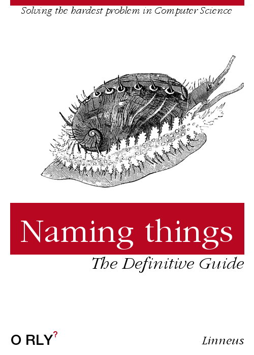
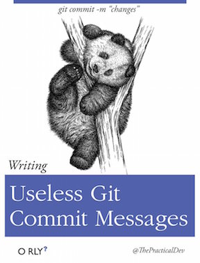
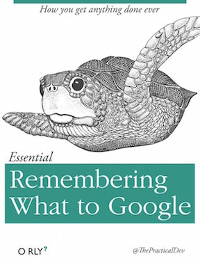

```{r setup, include=FALSE}
knitr::opts_chunk$set(echo = TRUE)
```

## Keep everything in one place. Why?
- Portability
- Replication
- Transparency

--

## Track version history
- Restore code that breaks
- See what you or others did (e.g. why did our results change?!?)

---

## Collaborating (even with non-git users)

#### With git users 
- Line-by-line merging/diff (code and writing)

#### With non-users 
- Share document URLs (Word, LaTeX, whatever)
- Merge in their changes (LaTeX)
- Share HTML project updates (summary stats, draft figures, to-do lists)
- Share data

---

## Repositories == Project folders

### + Subfolders
#### /data
#### /figs
#### /functions
#### /scratchpad

**Tip:** Use `source(setup.R)` in all scripts - where `setup.R` is a script to load the packages and functions used in your project.

---

## Finding things
#### `here()` a function for valid file paths: [Ode to the here() package](https://github.com/jennybc/here_here) 

#### **NEVER use `setwd()`!**

---
## Naming things!

#### **NEVER** untitled.R, ProblemSet.Rmd, Rplot.png!



--- 

## Basics 

### To get started
#### `git clone repositiory.url` (or, in RStudio, File -> New Project -> Verstion Congtol -> Git)
#### `git config --global user.name` 
#### `git config --global user.email`

--

## To do frequently
#### `git commit` - confirm your changes
#### `git pull` - merge in others' changes
#### `git push` - update online repository



---

## Avoid
### Committing files > 100MB

---

## Troubleshooting
### `git checkout` - restore a file from the online repo.
### `git reset` - read up on this before you do it! 
### If you really get stuck, trash your local folder and clone a fresh version, but first, google your error:



---

## [GitHub](https://GitHub.com)
### Easily build a website
#### Repository -> Settings -> GitHub Pages

### [GitHub pro is free for students](https://education.github.com/pack)
- unlimited collaborators on private repositories
