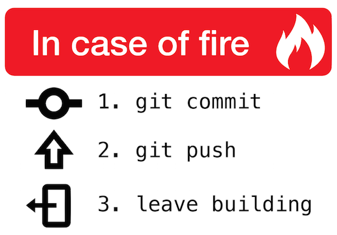

```{r setup, include=FALSE}
## Sets defaults for R chunks
knitr::opts_chunk$set(echo = TRUE, # echo = TRUE means that your code will show
                      warning=FALSE,
                      message=FALSE,
                      fig.retina = 2,
                      fig.align = "center", 
                      dpi = 100,
                      # fig.path='Figs/', ## where to save figures
                      fig.height = 3,
                      fig.width = 3)

library(here)
source(here("setup.R"))
```
class: center



---

## Keep everything in one folder.
- Portability
- Replication
- Transparency

--

## Track version history.
- Restore code that breaks
- See what you or others did (e.g. why did our results change?!?)

---

## Collaborating 

#### With git-users 
- Line-by-line merging/diff (code and writing)

#### With non-users 
- Share document URLs (Word, LaTeX, whatever)
- Merge in their changes (LaTeX)
- Share HTML project updates (summary stats, draft figures, to-do lists)
- [Share data](https://github.com/jtleek/datasharing)

---

## Repositories == Project folders

### + Subfolders
#### /data
#### /figs
#### /functions
#### /scratchpad

**Tip:** Use `source(setup.R)` in all scripts, where `setup.R` is a script that loads the packages and functions used in your project.

---

## Finding things
`here()` makes valid file paths: [Ode to the here() package](https://github.com/jennybc/here_here) 

```{r here}
## This works no matter where a script is saved in the project folder
d <- readstata13::read.dta13(here("data/EX1.dta"))
glimpse(d)
```

**NEVER** use `setwd()` or user-specific file paths (e.g. `"C:\Users\path\that\only\I\have"`)!

---

## Naming things!

**NEVER** name files untitled.R, data.csv, ProblemSet.Rmd, Rplot.png!


---

## Basics 

### To get started:
`git clone repositiory.url` in the terminal/consol.

(or, in RStudio, File -> New Project -> Version Control -> Git)

```{}
git config --global user.name "yourGitHubUserName"
git config --global user.email "yourEmail@email.com
```

(these do need to be done in the terminal/consol)

See a more details [here](http://r-pkgs.had.co.nz/git.html) and [this blog post](https://www.r-bloggers.com/rstudio-and-github/) for more detailed instructions for git setup in RStudio.

---

## To do frequently
- `git commit` - confirm your changes
- `git pull` - merge in others' changes
- `git push` - update online repository


---

## Avoid
- Useless commit messages
- Committing files > 100MB

---

## Troubleshooting
- `git checkout` - restore a file from the online repo.
- `git reset` - read up on this before you do it! 


---

## [GitHub](https://GitHub.com)
### Easily build a website
- Repository -> Settings -> GitHub Pages

### [GitHub pro is free for students](https://education.github.com/pack)
- unlimited collaborators on private repositories
