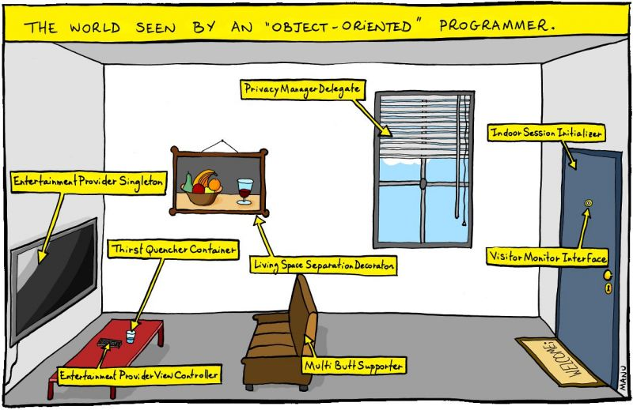

```{r setup, include=FALSE}
## Sets defaults for R chunks
knitr::opts_chunk$set(echo = TRUE, # echo = TRUE means that your code will show
                      warning=FALSE,
                      message=FALSE,
                      fig.retina = 2,
                      fig.align = "center", 
                      dpi = 100,
                      # fig.path='Figs/', ## where to save figures
                      fig.height = 3,
                      fig.width = 3)

library(here)
source(here("setup.R"))
```


---


# R
- Data frames are *objects*


---
# R Resources
- [Cheatsheets](https://www.rstudio.com/resources/cheatsheets/)!
- Hadley Wickham on [R for Data Science](https://r4ds.had.co.nz/)
- Garrett Grolemund on [R for Data Science](http://garrettgman.github.io/tidying/)
- Michael DeCrescenzo on [getting started with R](https://mikedecr.github.io/811/811-basics/)
- Sarah Bouchat on [getting started with R](https://bouchat.github.io/IntroDataMgmt20Jan.html) and [tidyverse and more](https://bouchat.github.io/Advanced3Feb.html)


---

## "Environment" = your objects
- Data, functions, etc.
- Do not "attach" data!

--

## Read in data
#### Loading saved R objects
`load()` works for objects saved as .Rdata from a local file or the web

#### New R objects
`d <- read.csv()` loads comma seperated values (a plain text spreadsheet)

`d <- read.dta13()` loads STATA data files int r

---
# Naming things!

## Data objects 
`d` for data with which you are working

A more descriptive name for the original object. For example: 
```{}
## Save a new object with a discriptive name
regulations <- d 
save(regulations, file = "data/regulations.Rdata")

## Load this object as the original while we mess with "d" again
load("regulations.Rdata")
d <- regulations
```

`m1` or `model.1` for model output, corresponding to how you discuss them the text:

"The p-value for coefficient 2 is \` r m1$p.value[2]\`."

---

## Variables

**Never** use variables x1, x2 or variable1, varible2, for real data! Good names make things easy to find, recall, guess, saving you time and headaches. For Example:

--

`varying` vs. `FIXED` values
- A common convention, aligned with math notation

Source 
- `values_from_dataset1` vs. `VALUES_FROM_DATASET2`
- If the source is key (e.g. when joining two similar datasets)

Transformations
- `modified_text` vs. `Original_Text`
- `modified_text <- tolower(Original_Text)`

---

### Whatever you do, use common formats

**Files** (budgetEPA2016.pdf, budgetEPA2017.pdf, budgetEPA2018.pdf)

**Figures** (commentsPerYear.png, commentsPerAgency.png, commentsPerAgencyPerYear.png)

**Variables** (`d$commentId`, `d$commentText`, `d$commentTotal`, `d$commentUniqueTotal`)

```{r selectnames}
starwars %>%  select(name, ends_with("color"))
```

---

#[Tidyverse](https://www.tidyverse.org/learn/)

## Data manipulation with [dplyr](https://dplyr.tidyverse.org/)

### `filter` data by logical conditions
```{r starwars_droids}
filter(starwars, species == "Droid")
```

---

### `summarize` by group (`n()`, `mean()`, `max()`, etc.)
```{r starwars_species}
starwars %>% 
  group_by(species) %>% 
  summarize(species_N = n()) %>% 
  arrange(-species_N)
```

---

### New variables with `mutate`
```{r starwars_species2}
starwars %>% 
  group_by(species) %>% 
  mutate(species_height = mean(height, na.rm = TRUE) ) %>% 
  mutate(species_height = round(species_height, 1) ) %>% 
  mutate(eye_colors = paste(unique(eye_color), collapse = ";")) %>%
  select(species, species_height, eye_colors) %>% 
  distinct() 
```

---

## Tidy model output with `broom`

```{r notbroom}
lm(height ~ mass, data = starwars)
```

```{r broom}
library(broom)
tidy(
  lm(height ~ mass, data = starwars),
  conf.int = TRUE
  )
```

---

# Readable code 
Nest vs. piecemeal vs. [pipes with `magrittr`](https://magrittr.tidyverse.org/articles/magrittr.html)

### Functions can be nested
```{r nest}
select(
  filter(
    filter(
      filter(starwars, species == "Droid"),
      eye_color == "yellow"),
    skin_color == "gold"),
  name, homeworld, ends_with("color"))
```

### But this can be confusing and hard to edit.

---

### Instead let's define an object and modify it.

```{r piecemeal}
d <- starwars
d <- filter(d, species == "Droid") 
## we can streamline by "piping" d in as the first argument with %<>%
## %<>% pipes in and back out, thus modifying d, just like above
d %<>% filter(eye_color == "yellow") 
d %<>% filter(skin_color == "gold")
select(d, name, homeworld, ends_with("color"))
```

### Better, certainly easier to read and edit.

---

### Now let's just pipe the object `starwars` to a series of functions with `%>%` from the [`magrittr`](https://magrittr.tidyverse.org/articles/magrittr.html) package.

```{r pipe}
starwars %>% 
  ## %>% pipes one way, allowing us to string functions together
  filter(species == "Droid") %>% 
  filter(eye_color == "yellow") %>% 
  filter(skin_color == "gold") %>% 
  select(name, homeworld, ends_with("color"))
  
```

## Even better!

---

### Being good at R is being good at google
New tasks are never easy
- Google your error 
- Search Stack Overflow or #rstats twitter


---

# Review: Don't:

- Copy and paste numbers, table, numbers, or figures into a paper
- Attach data
- Use `setwd()`
- Use user-specific file paths (e.g. `"C:\Users\path\that\only\I\have"`)
- Name files untitled.R, ProblemSet.Rmd, Rplot.png
- Name variables x1, x2 or variable1, varible2, in real data
- Nest when you can pipe
- Write useless commit messages
- Anger your future self by failing to comment your code


