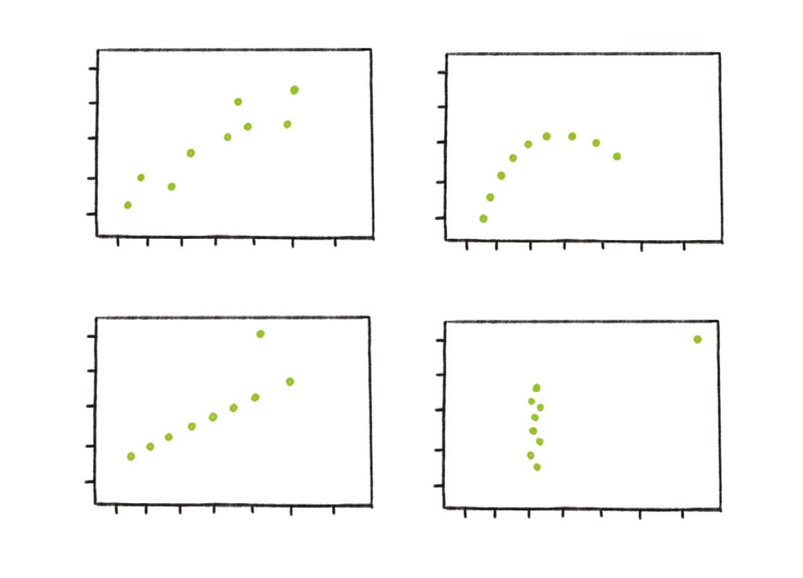
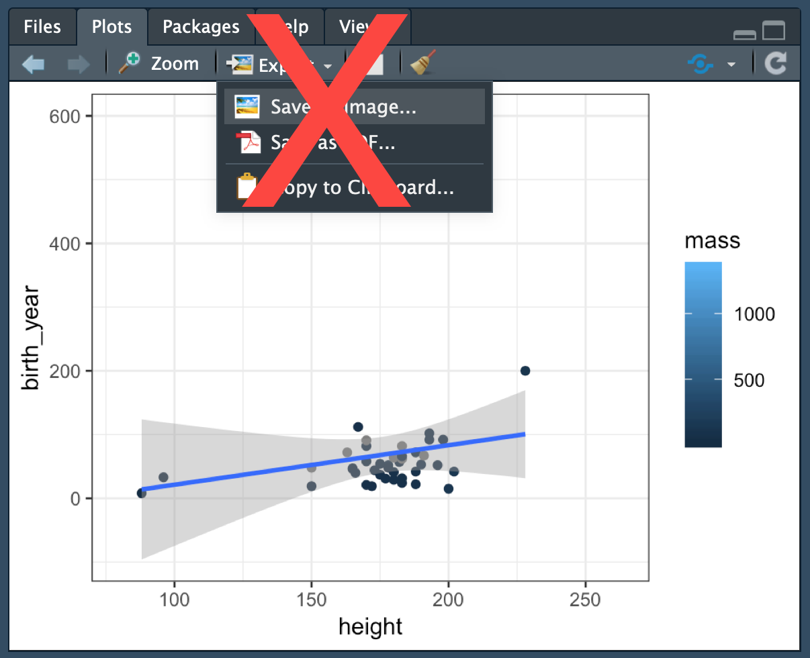

```{r setup, include=FALSE}
library(here)
source(here("setup.R"))
```


---

#### Short required reading
- [Data Visualization, Chapter 1 by Kieran Healy](http://socviz.co/lookatdata.html)
- [Charts change hearts and minds better than words do](https://www.washingtonpost.com/news/wonk/wp/2018/06/15/study-charts-change-hearts-and-minds-better-than-words-do/?utm_term=.89d85fd285ba)

#### Resources
- Andrew Heiss's [data viz class](https://datavizf18.classes.andrewheiss.com/schedule/)
- `ggplot` tips and tutorials from Dr. Jenny Brian's [stats class]((http://stat545.com/graph00_index.html)
- Claus E. Wilke on [Data Visualization](https://serialmentor.com/dataviz/index.html)
<!-- [Basic principles of data viz](https://www.geckoboard.com/learn/data-literacy/data-visualization-tips/) -->
- A plot that looks like ____? What is it called? -> look 
[here](https://datavizcatalogue.com/) and
[here](https://datavizproject.com/)

#### Data viz in R
- [R for Data Science: Import, Tidy, Transform, Visualize, and Model Data](https://r4ds.had.co.nz/data-visualisation.html)
- [Principles & Practice of Data Visualization] with ggplot2 by Dr. Alison Presmanes Hill](https://cslu.ohsu.edu/~bedricks/courses/cs631/)
- Examples from [data-to-viz.com](https://www.data-to-viz.com/) and in this [catalog (with R code)](http://shinyapps.stat.ubc.ca/r-graph-catalog/) from Joanna Zhao and Jenny Bryan, including [xkcd](http://shinyapps.stat.ubc.ca/r-graph-catalog/#0003_xkcd-and-direct-labelling)
- `ggplot2` [cheatsheet](https://www.rstudio.com/resources/cheatsheets/#ggplot2)
- Maps with `map_data()` from the `maps` package. Advanced maps: `r-spatial` [tutorial](https://r-spatial.github.io/sf/articles/sf5.html), `sf` [cheatsheat](https://github.com/rstudio/cheatsheets/blob/master/sf.pdf)  and `cartogrphy` [cheatsheet](https://github.com/riatelab/cartography)

---

# Why we plot 
## 1. To not lie
Avoid statistical fallacies.

## 2. To be clear
Our brains see patterns in distance, size, color, shape more easily than in numerals. Most analytic claims are about **variation** (**comparisons** and/or **relationships/trends**). Any numeric claim can be visualized.

"A picture is worth a thousand words."

--

*and far, far, far superior to ten numbers!

--

*"Always, always, always, plot the data"* - Dr. Jenny Brian

---

## [Anscombe’s Quartet](https://www.geckoboard.com/learn/data-literacy/statistical-fallacies/danger-of-summary-metrics/)



---

## `tidy()` model output with `broom`
See [these slides](https://opr.princeton.edu/workshops/Downloads/2016Jan_BroomRobinson.pdf),
[this vignette](https://cran.r-project.org/web/packages/broom/vignettes/broom.html), and 
[this example](http://varianceexplained.org/r/broom-intro/).

```{r notbroom}
lm(height ~ mass, data = starwars)
```

```{r broom}
lm(height ~ mass, data = starwars) %>%
  tidy(conf.int = TRUE)
```

```{r eval = FALSE, echo = TRUE}
"The p-value for `r m1$term[2]` is `r m1$p.value[2]`."
```


---

## `tidy()` model output is easy to plot


```{r tidy-coef-plot, fig.width=6}
m1 <- lm(birth_year ~ height + mass, data = starwars) %>% 
  tidy(conf.int = TRUE) 

m1 %>% 
  ggplot( aes(y = term, x = estimate) ) +
  geom_point() + 
  geom_errorbarh( aes(xmin = conf.low, xmax = conf.high) ) +
  geom_vline(xintercept = 0) # vertical line at 0
```

```{r eval = FALSE, echo = TRUE}
"The p-value for `r m1$term[2]` is `r round( m1$p.value[2], 3)`."
```
"The p-value for `r m1$term[2]` is `r round(m1$p.value[2], 3)`."

---

### Omit the intercept

```{r tidy-coef-terms-plot, fig.width=6}
m1 <- lm(birth_year ~ height + mass, data = starwars) %>% 
  tidy(conf.int = TRUE) 

m1 %>%
  filter(term != "(Intercept)") %>% 
  ggplot( aes(y = term, x = estimate) ) +
  geom_point() + 
  geom_errorbarh( aes(xmin = conf.low, xmax = conf.high)) +
  geom_vline(xintercept = 0) # vertical line at 0
```

```{r eval = FALSE, echo = TRUE}
"The p-value for `r m1$term[2]` is `r round( m1$p.value[2], 3)`."
```
"The p-value for `r m1$term[2]` is `r round(m1$p.value[2], 3)`."

---

### Pointrange

```{r tidy-pointrange-plot, fig.width=6}
m1 <- lm(birth_year ~ height + mass, data = starwars) %>% 
  tidy(conf.int = TRUE) 

m1 %>% 
  filter(term != "(Intercept)") %>% 
  ggplot( aes(x = term, y = estimate) ) +
  # geom_pointrange() is like geom_point() + geom_segment()
  geom_pointrange( aes(ymin = conf.low, ymax = conf.high) ) + 
  geom_hline(yintercept = 0) # horizontal line at 0
```

```{r eval = FALSE, echo = TRUE}
"The p-value for `r m1$term[2]` is `r round( m1$p.value[2], 3)`."
```
"The p-value for `r m1$term[2]` is `r round(m1$p.value[2], 3)`."

---

### Pointrange + coord_flip()

```{r tidy-pointrange-flip, fig.width=6}
m1 <- lm(birth_year ~ height + mass, data = starwars) %>% 
  tidy(conf.int = TRUE) 

m1 %>% 
  filter(term != "(Intercept)") %>% 
  ggplot( aes(y = estimate) ) +
  # geom_pointrange() is like geom_point + geom_segment
  geom_pointrange( aes(x = term, ymin = conf.low, ymax = conf.high) ) + 
  geom_hline(yintercept = 0) + # "horizontal" line at 0
  coord_flip() # flip x and y axes
```

```{r eval = FALSE, fig.width=6}
"The p-value for `r m1$term[2]` is `r round( m1$p.value[2], 3)`."
```
"The p-value for `r m1$term[2]` is `r round(m1$p.value[2], 3)`."

---

class: inverse

## Always plot the data.

--

```{r point, fig.width=8, fig.height = 5}
starwars %>% 
ggplot( aes(x = height, y = birth_year) ) + 
  geom_point( aes(size = mass) ) + 
  geom_text(aes(label = ifelse(birth_year > 750, name, NA)), size =4, hjust = 0)
```

---

## Ideally, contrast data with claims.

```{r lm, fig.width=8, fig.height = 5}
starwars %>% 
ggplot( aes(x = height, y = birth_year) ) + 
  geom_point( aes(size = mass) ) +  
  geom_smooth(formula =  "y ~ x", method = "lm")
```

---

# #!

```{r lm-drop-outlier, fig.width=8, fig.height = 5}
starwars %>% filter(name != "Yoda") %>% 
ggplot( aes(x = height, y = birth_year) ) + 
  geom_point( aes(size = mass) ) + 
  geom_smooth(formula =  "y ~ x", method = "lm")
```

---

## !!

```{r lm-drop-outlier2, fig.width=8, fig.height = 5}
starwars %>% filter(!name %in% c("Yoda", "Jabba Desilijic Tiure") ) %>% 
ggplot( aes(x = height, y = birth_year) ) + 
  geom_point( aes(size = mass) ) + 
  geom_smooth(formula =  "y ~ x", method = "lm")
```

---

## Regression fit by group

```{r lm-by-group, fig.width=8, fig.height = 5}
starwars %>%
  mutate(Human = species == "Human") %>% 
ggplot( aes(x = height, y = birth_year) ) + 
  geom_point( aes(size = mass) ) + 
  geom_smooth(formula =  "y ~ x", method = "lm", aes(color = Human) )
```

---


# `ggplot()`

---

**aes**thetics: map variables onto things people can see (position, color, etc.)

**geom**: what to plot (points, lines, etc.)

**scale**: data values to "computer" values (negative = "red", thousands = value/1000, etc.)

**facet**: split into mini-plots comparing subsets ("small multiples")

```{r starwars-height, fig.width=8, fig.height= 3.5}
starwars %>% 
  unnest(films) %>% 
  filter(films %in% c("Return of the Jedi", "The Force Awakens")) %>% 
ggplot( aes(x = birth_year, y = height, size = mass, color = species) ) + 
  geom_point(alpha = .5) + 
  geom_text(aes(label = name), size = 4, hjust = 0, vjust = 0, check_overlap = T) + 
  scale_x_continuous(limits = c(0, 1000) ) + 
  facet_wrap("films") + # facet by film
  labs(x = "Age", y = "Height (cm)", color = "Species", size = "Mass")
  
  

```

---
## Mapping

```{r map-world-data, fig.width=8, fig.height=4}
world <- map_data("world")

head(world)
```
---

```{r map-world, fig.width=10, fig.height=6}
world %>% 
ggplot( aes(x = long, y = lat) ) +  
  # A map layer of country shapes
  geom_polygon( aes(group = group), fill = NA, color = "grey") +
  # We are here: 43.0731° N, 89.4012° W
  geom_point(aes(x=-89.4012, y=43.0731), color = "Red") 
```

---
```{r map-wi-points, fig.width=6, fig.height=6}
wi <- map_data("county", "wisconsin")

wi %>% 
  group_by(subregion) %>%
ggplot( aes(x = long, y = lat, group = group) ) +
  geom_point() +
  geom_polygon(fill = NA, color = "grey60")

```

---

```{r map-wi, fig.width=6, fig.height=6}
wi <- map_data("county", "wisconsin")

wi %>% 
  group_by(subregion) %>%
  # Find the center of each subregion
  mutate(center_lat = mean(range(lat) ),
         center_long = mean(range(long) ) ) %>%
ggplot( aes(x = long, y = lat, group = group) ) +
  geom_polygon(fill = NA, color = "grey60") +
  geom_text( aes(x = center_long, y = center_lat, label = subregion), size = 2, angle = 45, check_overlap = T)
```

---
Ysing GIS data with `sf` (see [full example](https://github.com/judgelord/PS811/example_map_canada.Rmd), adapted [from Kieran Healy](https://kieranhealy.org/blog/archives/2018/12/09/canada-map/)).

```{r canada, fig.width=10, fig.height=6}
canada_cd <- st_read("data/canada_cd_sim.geojson", quiet = TRUE) 

canada_cd %>% 
ggplot() + 
  geom_sf(mapping = aes(fill = PRUID)) + # provence ID
  guides(fill = FALSE)
```

---
Change projection with `st_transform`: 

```{r canada- projection, fig.height=6, fig.width=10}
canada_cd %>% 
  # Lambert Conformal Conic projection
  st_transform(crs = "+proj=lcc +lat_1=49 +lat_2=77 +lon_0=-91.52 +x_0=0 +y_0=0 +datum=NAD83 +units=m +no_defs") %>%
ggplot() + 
  geom_sf(mapping = aes(fill = PRUID)) + # provence ID
  guides(fill = FALSE)
```

---

# Transformations
`stat` $\in$ \{count, density, etc.\} (nothing you could not wrangle)

## Distributions with `geom_density`

```{r, fig.height=3, fig.width=8}
lincoln_weather %>% 
ggplot( aes(x = `Mean Temperature [F]`) ) +
  geom_density() +
  facet_wrap("Month")

glimpse(lincoln_weather)
```

---

`ggridges`, lets us use a `y` scale instead of facets:

```{r dist, fig.height=6, fig.width=8}
library(ggridges)

lincoln_weather %>% 
ggplot( aes(x = `Mean Temperature [F]`, y = Month, fill = ..x..) ) +
  geom_density_ridges_gradient(scale = 3, rel_min_height = 0.01) +
  scale_fill_viridis_c() +
  labs(title = "Temperatures in Lincoln NE in 2016", fill = "Temp. [F]")
```

---
## Saving figures

*DO NOT save mouse-y style



---

### `ggsave()` in .R
```{r, eval = FALSE}
ggplot(...) 
ggsave(here("Figs/figure-name.png"), width = 3, height = 3) # or .pdf etc.
```

### In .Rmd, figures save when you knit
```{r, eval = FALSE}
knitr::opts_chunk$set(here(fig.path="Figs/"),
                      fig.height = 3,
                      fig.width = 3)
```
### Chunk names = figure names! 


