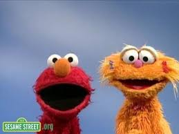
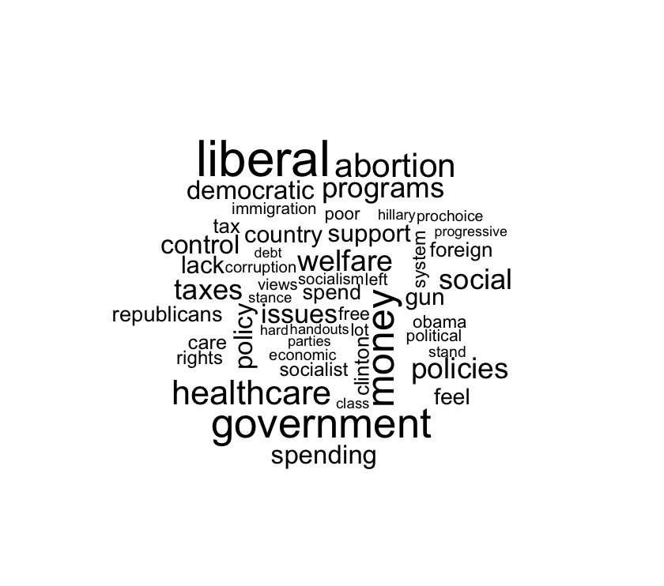
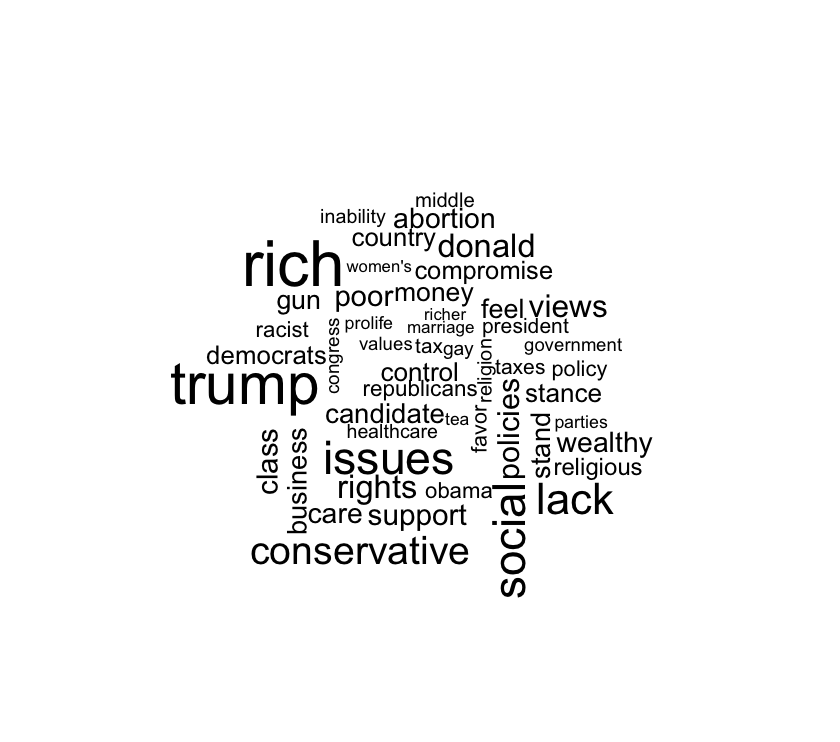

```{r setup, include=FALSE}
source(here::here("setup.R"))
```

# 1. Counting


---

# 1. Counting

# 2. Matching


---

# 1. Counting

# 2. Matching

# 3. Classifying



---

# 1. **Counting**

# 2. Matching

# 3. Classifying

---

## Resources 
- [Tidy text class by Andrew Heiss](https://datavizf18.classes.andrewheiss.com/class/11-class/)
- [`tidytext`](https://cran.r-project.org/web/packages/tidytext/tidytext.pdf) packate
- [A tidy approach to text analysis](https://www.tidytextmining.com/) including
[topic modeling](https://www.tidytextmining.com/topicmodeling.html) and
[tidy() for Structural Topic Models from the `stm` package](https://juliasilge.github.io/tidytext/reference/stm_tidiers.html). More [here](https://rdrr.io/cran/tidytext/man/stm_tidiers.html).

## Reading 
[Introduction to cluster analysis](https://eight2late.wordpress.com/2015/07/22/a-gentle-introduction-to-cluster-analysis-using-r/)
- Tidy Natural Language Processing with [`cleanNLP`](https://scholarship.richmond.edu/cgi/viewcontent.cgi?article=1195&context=mathcs-faculty-publications)

---

## Word frequency


Responses to ANES question "What do you dislike about [Democrats/Republicans]?" (V161101, V161106)
```{r ANES-data}
load(here("data/ANESdislikes.Rdata"))
d <- ANESdislikes
d[1,]
```

Tokenize by word
```{r ANES-tokens}
words <-  unnest_tokens(d, word, response)
head(words)
```

```{r count}
words %<>%
  anti_join(stop_words) %>% ## Replace meaningless words 
  filter(!str_detect("people|just|dont|like|about|democrat|republican|party|[0-9]", word) ) %>%
  group_by(question) %>%
  count(word) # Count words per groups
```

---

## Word frequency

```{r ANESfrequency}
words %>%
  top_n(10) %>% ## Top 10 words in each group
  ggplot() +
  aes(x = reorder(word, n), y = n) + 
  geom_col() + 
  coord_flip() +
  facet_grid(question ~., scales = "free_y") + 
  labs(x = "Word", y = "Count")
```

---


```{r ANES-wordcloud, fig.height=2, fig.width=2, eval=FALSE, fig.show = 'hide'}
words %>%
  filter(question == "dislike_about_GOP") %>% 
  with(wordcloud(word, n, max.words = 50))
```

 


---


