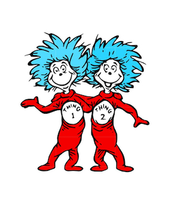
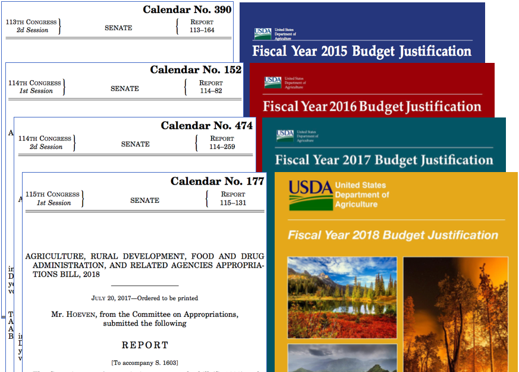

```{r setup, include=FALSE}
source("setup.R")
```


## 1. Counting


--

- text features $\in$\{all* words, some words, phrases, etc.\} 

---

## 1. Counting

- text features $\in$\{all* words, some words, phrases, etc.\} 

## 2. Matching


--

- Exactly* the same string ("regular expressions", text reuse)

---

## 1. Counting
- text features $\in$\{all* words, some words, phrases, etc.\} 

## 2. Matching
- Exactly* the same string ("regular expressions", text reuse)

## 3. Classifying


---

## 1. Counting
- Text features $\in$\{all* words, some words, phrases, etc.\}

## 2. Matching
- Exactly* the same string ("regular expressions", text reuse)
- "Fuzzy"" matching is really exact matching a set of variants

## 3. Classifying
- Rules vs. probability
- Supervised vs. unsupervised

---

## Resources 
- [Tidy text class by Andrew Heiss](https://datavizf18.classes.andrewheiss.com/class/11-class/)
- [`tidytext`](https://cran.r-project.org/web/packages/tidytext/tidytext.pdf) package
- Regular expressions with `stringr`--[cheasheet](http://edrub.in/CheatSheets/cheatSheetStringr.pdf)
- [Tidy text analysis](https://www.tidytextmining.com/) including
[topic modeling](https://www.tidytextmining.com/topicmodeling.html) and
[tidy() for Structural Topic Models](https://juliasilge.github.io/tidytext/reference/stm_tidiers.html) from the `stm` package. More [here](https://rdrr.io/cran/tidytext/man/stm_tidiers.html).

## Reading 
- [Introduction to cluster analysis](https://eight2late.wordpress.com/2015/07/22/a-gentle-introduction-to-cluster-analysis-using-r/)
- Tidy Natural Language Processing with [`cleanNLP`](https://scholarship.richmond.edu/cgi/viewcontent.cgi?article=1195&context=mathcs-faculty-publications)
- [Text from audio](https://www.cambridge.org/core/journals/political-analysis/article/testing-the-validity-of-automatic-speech-recognition-for-political-text-analysis/E375085D96331A47E810C01AA6DB0A46)
- Here is an [ok blog post on visualizing qualitative data](https://depictdatastudio.com/how-to-visualize-qualitative-data/)--lmk if you find a better resource. 

---

## Cool applications:
- [Gender tropes in film](https://pudding.cool/2017/08/screen-direction/)
- [Analysis of Trump's tweets confirms he writes only the (angrier) Android half](http://varianceexplained.org/r/trump-tweets/)
- [Every time Ford and Kavanaugh dodged a question, in one chart](https://www.vox.com/policy-and-politics/2018/9/28/17914308/kavanaugh-ford-question-dodge-hearing-chart)

---

class: inverse

# Counting things in fancy ways.

--

With tidy text, counting words or phrases is simple:

- `unnest_tokens()` splits each response into tokens (by word by default, but we can also tokenize by phrases of length n, called n-grams).

- [optional] `anti_join(stop_words)` removes words that often have little meaning, like "a" and "the", called stop words. We can also do this with with `filter(!(word %in% stop_words$word))`

- `count()` how many times each word appears (`count(word)` is like `group_by(word) %>% summarize(n = n()) %>% ungroup()` )

---

## Word frequency

Responses to ANES question "What do you dislike about [Democrats/Republicans]?" (V161101, V161106)
```{r ANES-data}
load(here("data/ANESdislikes.Rdata"))
d <- ANESdislikes
d[1,]
```

Tokenize by word
```{r ANES-tokens}
words <-  unnest_tokens(d, word, response)
head(words)
```

---

```{r count, cache = FALSE}
words %<>%
  ## Two ways to replace meaningless words: 
  ## 1. anti-join() a data frame with a column of words you don't want called 'word'
  anti_join(stop_words) %>% 
  ## 2. Simply filter out a strings you don't want separated with "|" (the regular expression for "or")
  filter(!str_detect(word, "people|just|dont|like|about|democrat.|republican.|party|[0-9]") ) %>%
  group_by(question) %>%
  ## Count the number of times each word occurs in each group
  count(word) 
head(words)
```

---

```{r ANESfrequency, fig.height=4, fig.width=6}
top_n(words, 10) %>% ## Top 10 words in each group
  ggplot( aes(x = reorder(word, n), y = n) ) +
  geom_col() + 
  coord_flip() +
  facet_wrap("question", scales = "free_y", strip.position="top") + 
  labs(x = "Word", y = "Count")
```

---

```{r ANES-wordcloud, eval=FALSE}
words %>%
  filter(question == "dislike_about_GOP") %>% 
  with(wordcloud(word, n, max.words = 50))
```


---

Word clouds only show word frequency, and font size is hard to visually compare. Nevertheless, [they may be useful](https://www.vis4.net/blog/2015/01/when-its-ok-to-use-word-clouds/) if all you care about is frequency.

---

Tokenize by word pair ("bi-gram")
```{r ANES-tokens-b}
## Name the new column d$bigrams ("ngrams" where n = 2)
bigrams <-  unnest_tokens(d, bigram, response, token = "ngrams", n = 2) 
head(bigrams)
```

```{r count-b, cache = FALSE}
## Count the number of times each bigram occurs in each group
bigrams %<>%
  group_by(question) %>%
  count(bigram) 
```

---

```{r ANESfrequency-b, fig.height=4, fig.width=6}
## Top 10 bigrams in each group
top_n(bigrams, 10) %>% 
  ggplot( aes(x = reorder(bigram, n), y = n) ) +
  geom_col() + 
  coord_flip() +
  facet_wrap("question", scales = "free_y", strip.position="top") + 
  labs(x = "Bigram", y = "Count")
```

---

# 2 Matching

## Global alignment 
(more counting than matching)

Used in: overall document similarity

## Local alignment 
- Exact (`==`)
- Patterns (Regular expressions,  `stringr`)
- Fuzzy patterns

Used in: text-reuse/plagerism, web scraping, data cleaning

---

(not propensity score matching, probably don’t do that.)

<blockquote class="twitter-tweet" data-lang="en"><p lang="en" dir="ltr">Page proofs from the important new King &amp; Neilsen paper. This is one of those times. Many of us have had this conversation before, perhaps many times. But none of us wrote the paper up. <br><br>tl;dr propensity score matching is dead.<br><br>Ungated: <a href="https://t.co/dmiJaLkFj4">https://t.co/dmiJaLkFj4</a> <a href="https://t.co/RRschUXSuE">pic.twitter.com/RRschUXSuE</a></p>&mdash; Jake M. Grumbach (@JakeMGrumbach) <a href="https://twitter.com/JakeMGrumbach/status/1108480915095896066?ref_src=twsrc%5Etfw">March 20, 2019</a></blockquote>
<script async src="https://platform.twitter.com/widgets.js" charset="utf-8"></script>

---

## Resources

Matching usually involve doing the same thing lots of times, so we use [functions](https://nicercode.github.io/guides/functions/)
- [`purrr`](https://www.rstudio.com/resources/cheatsheets/#purrr) offers tools to apply functions to data (instead of writing loops where we have to index everything) 

Web scraping also requires manipulating HTML. 
- [Khan Academy intro to HTML.](https://www.khanacademy.org/computing/computer-programming/html-css/intro-to-html/pt/html-basics)
- `rvest` offers tools for web scraping. Here is a [tutorial on Data Camp](https://www.datacamp.com/community/tutorials/r-web-scraping-rvest0)

Once we have scraped text, we need to clean it and extract the things we care about, both task for [RegEx]( https://www.rstudio.com/wp-content/uploads/2016/09/RegExCheatsheet.pdf)
- For tools to manipulate text, see the stringr cheatsheet: https://www.rstudio.com/resources/cheatsheets/#stringr
- Matt Denny has a [nice tutorial on cleaning text](http://www.mjdenny.com/Text_Processing_In_R.html)

---

## Global alignment 

How similar are pairs of texts are overall (i.e. statistically)

1. Count things, usually word frequencies.
    - Recall the [congressional letters example](https://judgelord.github.io/PS811/text-legislator-letters.html)
    - The result is a high-dimension object. (If each word is a variable, we may have thousands of variables!)
2. Compare distributions
    - Cosign similarity scores (pairwise similarity score)
    - Dimensional scaling (reduce variation to one or two spatial dimensions)
    
---

## Global alignment 

```{r, out.width = "400px", echo=FALSE}
knitr::include_graphics(here("Figs/seuss.jpg"))
knitr::include_graphics(here("Figs/samedifferent.jpg"))
```


---

## Local alignment  

 


---

Exact (`==`) vs. patterns (RegEx + `str_detect()`)

```{r}
strings <- c("Zoe", "Elmo", "Thing 1", "Thing 2", "are your politics more like Sesame Streat or Dr Suess?")

strings == "Zoe"

strings == "Thing [0-9]"

str_detect(strings, "Thing [0-9]")

str_extract_all(strings, "[A-Z][a-z]*",simplify = TRUE)
```

---

```{r, out.width = "600px", echo=FALSE}
knitr::include_graphics(here("Figs/regex-animal.jpg"))
```

---

# Web scraping

99% of web scraping is finding the information we want and wrangling it into a data frame. 

`rvest`
`read_html("http://google.com", encoding = "ISO-8859-1")`

`rvest` + `httr`
`google2 <- read_html(httr::GET("http://google.com"))`

```{r}
html <- read_html("https://www.UN.org/")
links <- html_nodes(html, "a")
html_text(links)[2:7]
```

[Example: A list of companies lobbying the U.S. Federal Energy Regulatory Commission]()

[Example: A **table** including the **text of scanned pdf** letters from Members of Congress]()

---
class: inverse center

## Text-reuse/plagerism

---

## Measuring similarity:
- Percent copied words, ngrams, sentences
- Percent unaligned (e.g. Smith-Waterman Local Alignment)
- Global alignment scores
- Change in topic proportions ($\sum (\theta_d - \theta_{d'})$)

## Measuring change across versions:
- Percent new words, ngrams, sentences
- Percent unaligned (e.g. Smith-Waterman Local Alignment)
- Global Alignment Scores
- Change in topic proportions ($\sum (\theta_d - \theta_{d'})$)

---

### For example, changes in budget text and committee reports [[see more]()]:



---
### When similar words mean different things, edits matter:

2010: `"CLIMATE CHANGE The Committee continues to support the Administration's efforts to address climate change. Funding for its voluntary climate change programs are continued through this bill."`

2012: `"CLIMATE CHANGE This Committee remains skeptical of the Administration's efforts to re-package existing programs and to fund new ones in the name of climate change."`

---

### Edits may introduce new ideas in otherwise aligned text:

2017: `"When the Subcommittee heard from the FDA it focused on preventing burdensome regulations for producers and the American people in addition to ongoing discussions of how the FDA is implementing the Food Safety Modernization Act FSMA `and the  XXXXXXXXX motivation XXXXXX for XXXXX the generic drug labeling rule `and regulation of tobacco products"`

2018: `"When the Subcommittee heard from the FDA it focused on preventing burdensome regulations for producers and the American people in addition to ongoing discussions of how the FDA is implementing the Food Safety Modernization Act FSMA `XXX XXX addressing XXXXXXXXX opioid XXX abuse XXX XXXXXXX XXXX XXXXXXXX XXXX `and regulation of tobacco products"`

---

## Smith-Waterman
Tracing a path through the matrics of the two documents, maximizing matches (technically, giving points for sequences of matches and mismatches). [[More on Smith-Waterman for text](http://fridolin-linder.com/resources/2016/03/30/local-alignment.html)]

```{r, out.width = "500px", echo=FALSE}
knitr::include_graphics(here("Figs/smith-waterman.png"))
```


---

## N-gram window
Finding all exact matches of n-grams or more

With a 5-gram window:

2010: "CLIMATE CHANGE The Committee continues to support `the Administration's efforts to address climate change. Funding for its voluntary climate change programs are continued through this bill."`

2012: "CLIMATE CHANGE This Committee remains skeptical of `the Administration's efforts to re-package existing programs and to fund new ones in the name of climate change."`

From this example: [Change and influence in budget texts]()

Another example: [Public comments on proposed regulations]()

---


