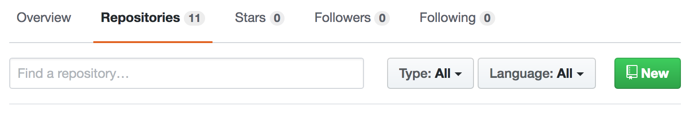
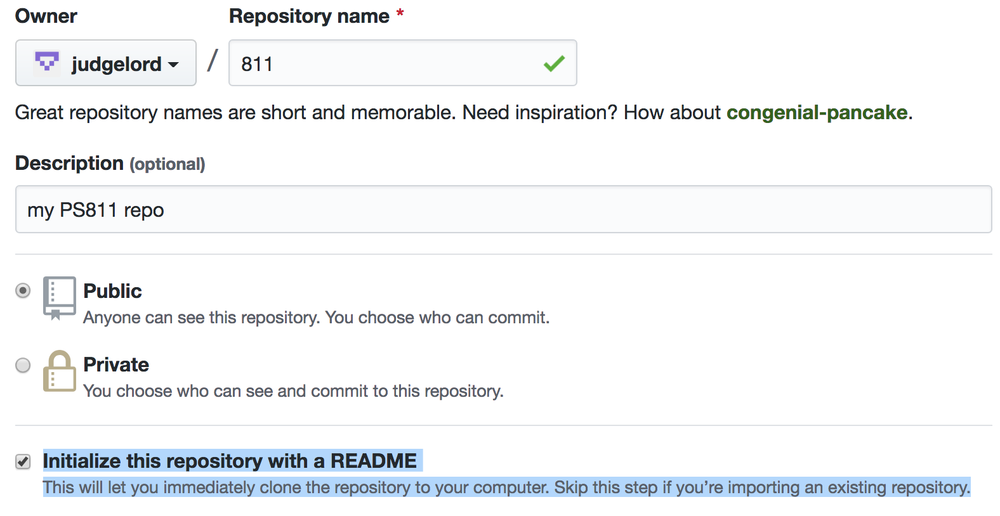
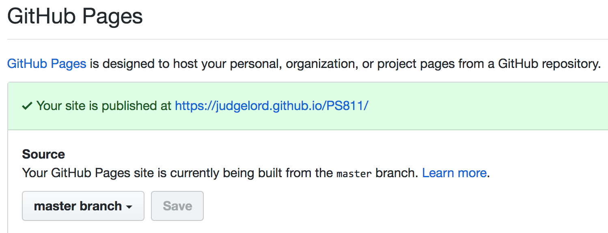
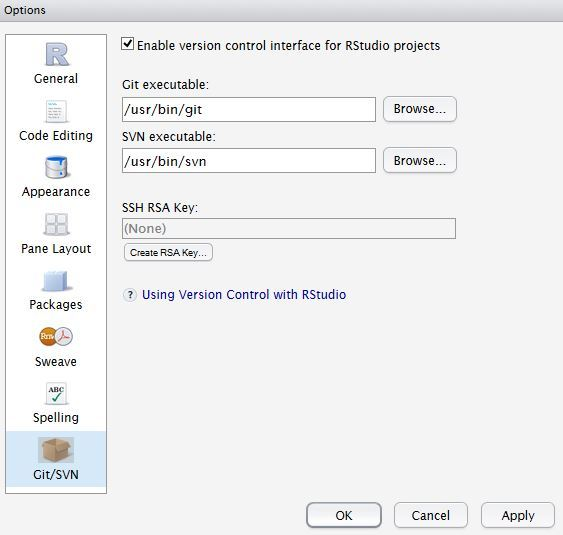
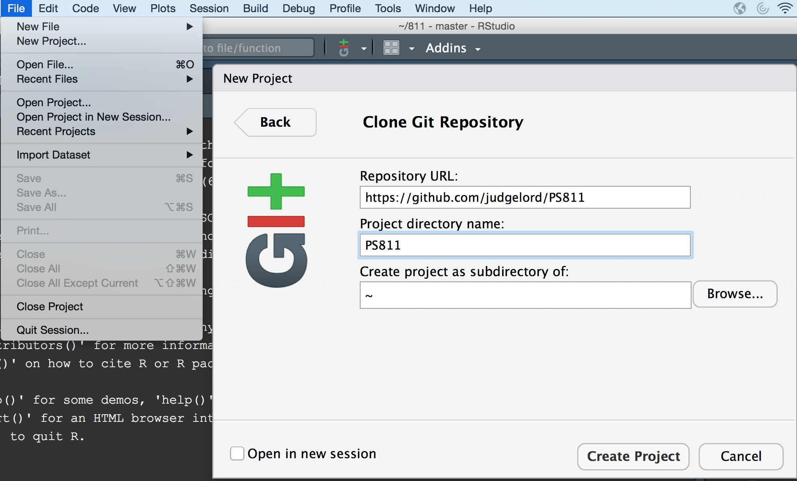
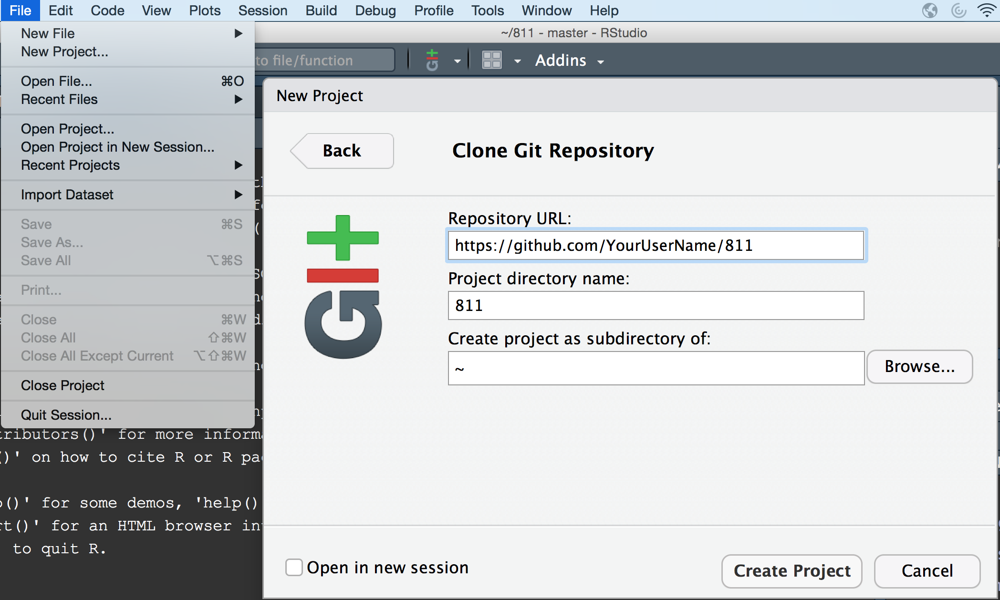
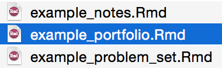
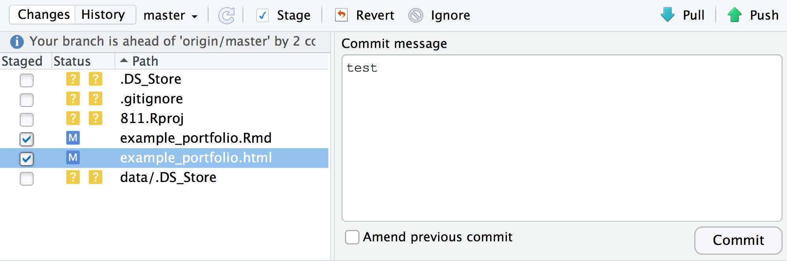

## Getting started with git

Getting started may be a bit of work, but it will save us time the rest of the semester and beyond. I broke down the process into 10 small steps. **Note: you do not need github desktop**, steps 1-4 are on GitHub.com and steps 5-10 are in RStudio.

1. Sign in to your GitHub.com account, go to the Repository tab, and click on the green "New" button:

2. Name this new repository "811" (not PS811) and initialize with a README.

3. Go to the "Settings" tab, scroll down to "GitHub Pages," and select "master branch" from the "Source" menu.

4. Go to the "Code" tab (your GitHub's main page) and copy the URL of this repository, i.e. https://github.com/YourUserName/811

---

---

5. Now, download (i.e. "clone") the **PS811** class repository. 

Note: The instructions below are brief. See a more detailed walk through [here](http://r-pkgs.had.co.nz/git.html) and [this blog post](https://www.r-bloggers.com/rstudio-and-github/) for more detailed instructions on git setup for RStudio.

In RStudio: First, enable git:

Options (PC)/Prefrences (Mac) -> Git/SVN -> [$\checkmark$] Enable version control.

Then, make a new [project](https://support.rstudio.com/hc/en-us/articles/200526207-Using-Projects) called PS811:

File -> New Project -> Version Control -> Git -> paste this URL

6. Also, download your new **811** repository:

7. Open the `example_portfolio.Rmd` file from the **PS811** class folder and Save As `portfolio.Rmd` to your **811** folder. It should appear in your Files pane because you should be in your 811 [project](https://support.rstudio.com/hc/en-us/articles/200526207-Using-Projects) (If not try File -> Recent Projects to get to your 811 project).

8. Add your name `Author: "Your Name"` and delete the example text below the line `<!-- Replace the below with bit about you. -->`

9. Hit the "Knit" button to make a new HTML: `portfolio.html`.

10. From small the blue-red-green Git button menu, select "Commit" and select your new `portfolio.Rmd` and `portfolio.html` files (I would just never commit your `811.Rproj` workspace file as it may someday be too large). "Commit" these two files with a discriptive message like "add portfolio", then "Push" to your GitHub (in the future, you will first "pull" in new changes--e.g. comments I may have on your work). You may be asked for your GitHub username and password.

**Tip** Entering these two lines into your terminal/consol/shell will let you skip having to enter your username in the future:

`git config --global user.email "youremail@email.com"`
`git config --global user.name "yourGitHubUserName"`

See [this blog post](https://www.r-bloggers.com/rstudio-and-github/) for instructions on how to skip having to enter your password. 

Your page should soon be live at https://YourUserName.github.io/811/portfolio.html

You are now almost done with Assignment #2. You just need to write a few sentences for the following and repeat steps 9 and 10 to update your page. 

### Research Interests

### Questions I hope to answer

### Potential methods

### Potentially relevant data